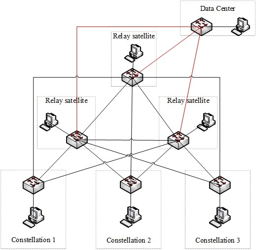
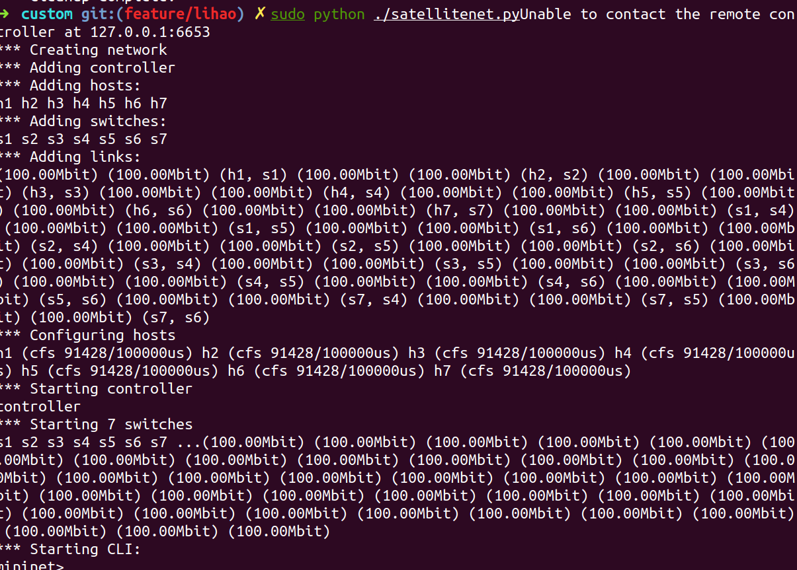
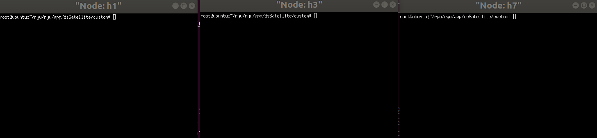
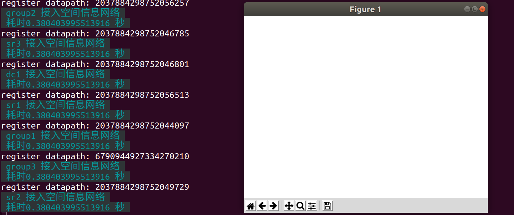
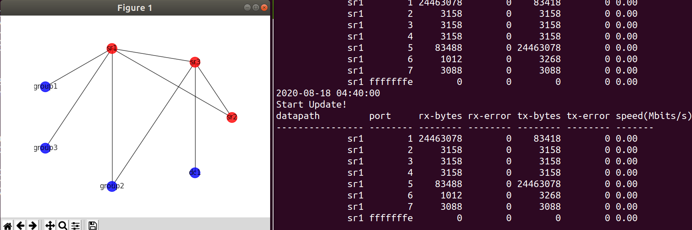
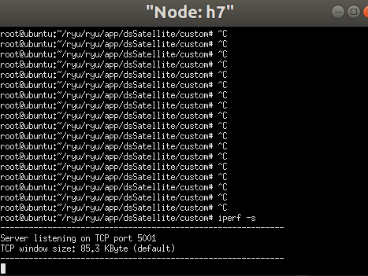
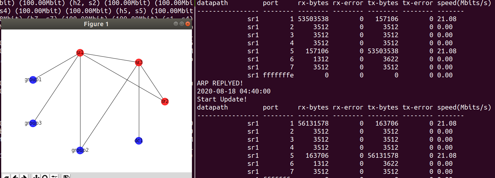
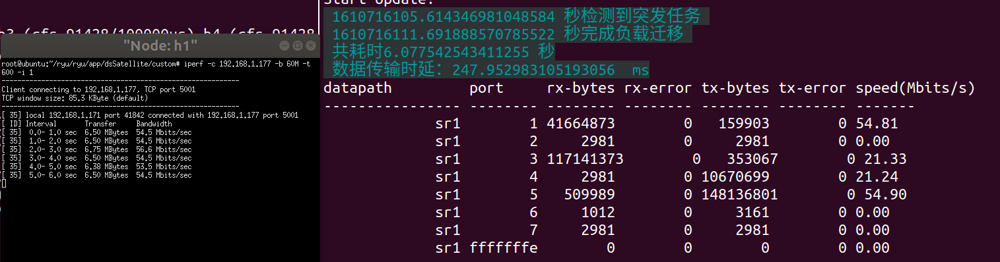

# 介绍

   <font face="宋体" size=4>该文件为硬件搭建平台控制器代码。可部署至硬件平台，也可利用Mininet仿真。所对应的硬件连接方式如下，本代码也提供了利用Mininet仿真出如下环境的代码，建议使用Mininet进行展示。</font>



# 环境配置
```
Ubuntu 18
ryu 4.34
mininet 2.3
pyhton3
```
## 安装依赖项
```
打开终端，输入python3查看是否有python3
若没有:
sudo apt-get install python3
请严格按照此方式安装，不要按照网上教程安装python!
```

```
pip3 install datetime networkx

sudo apt-get install python-numpy python-scipy python-matplotlib ipython ipython-notebook python-pandas python-sympy python-nose
```

## 运行
### 1. 将整个文件夹拷贝进${你的ryu路径}/ryu/app中

### 2. 运行mininet

打开新终端
```
cd ${你的ryu路径}/ryu/app/dsSatellite/custom
sudo python3 ./satellitenet.py
```
显示出如下界面：


在该终端的"minine>"后输入xterm h1 h3 h7.效果如下：



### 3. 运行控制器
```
打开终端
cd ${你的ryu路径}/ryu/app/dsSatellite
ryu-manager simple_switch.py --ofp-tcp-listen-port 6653
```
若报错：
```
[Errno 98] Address already in use
```
则在终端输入
```
sudo netstat -ap | grep 6653
找到对应pid号（xxxx）
sudo kill xxxx
```
应产生如下界面：

白色界面表示网络正在进行初始化，非常正常等个半分钟就会显示出拓扑图，左侧为各个节点接入空间信息网络的时间。

### 4. 负载迁移

4.1. 等待网络拓扑图正确显示后效果如下：


4.2 在h7的终端中输入
```
iperf -s
```
如下图所示


4.3 在h3(常态业务发起方)的终端中输入
```
iperf -c 192.168.1.177 -b 20M -t 600 -i 1
```
从图右边结果来看SDN控制器检测到了20M的常态业务流量


4.4 在h1(突发业务发起方)的终端中输入
```
iperf -c 192.168.1.177 -b 60M -t 600 -i 1
```
因为之前已经发起20M，现在又发起60M突发业务流量，所以网络会进行负载迁移，效果如下

效果是网络共监控到80M流量