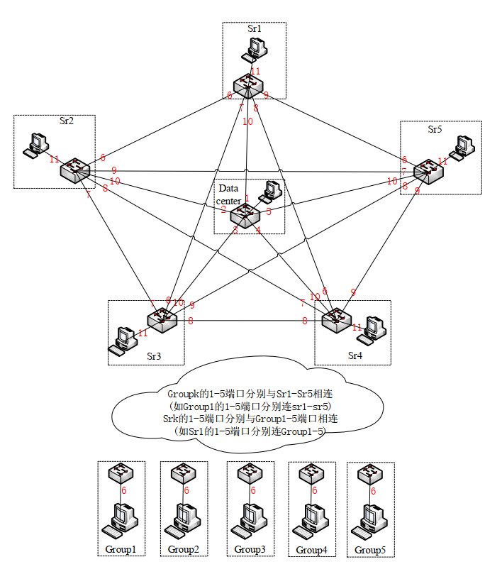
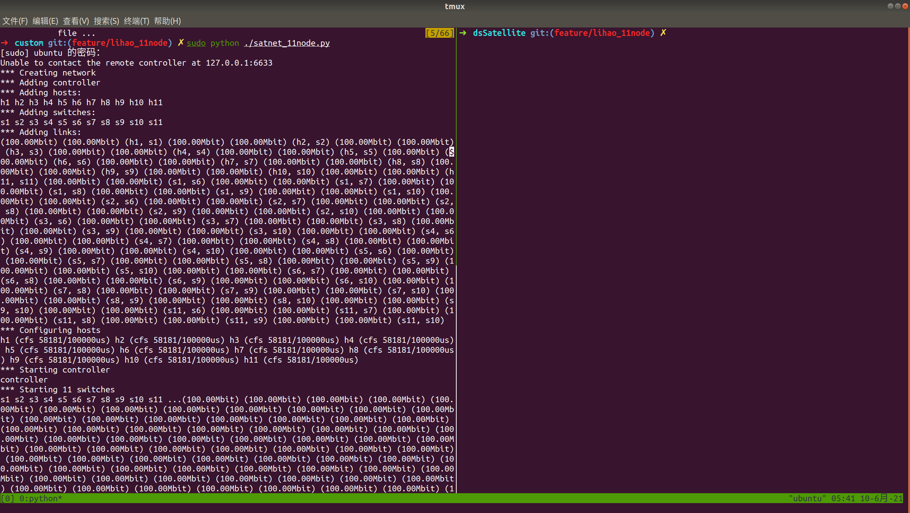
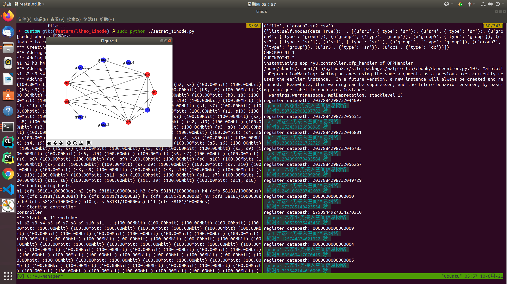
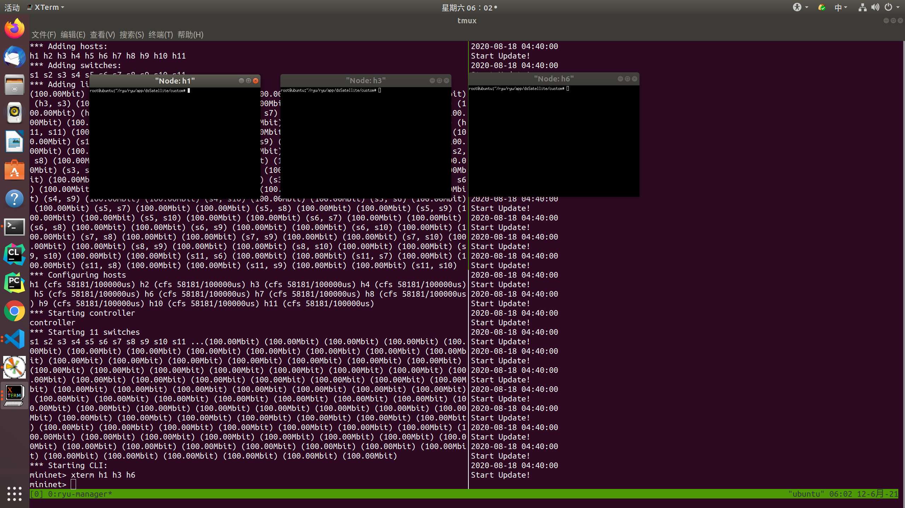
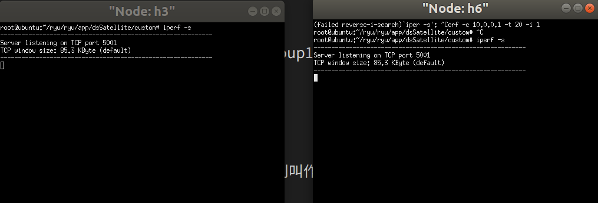
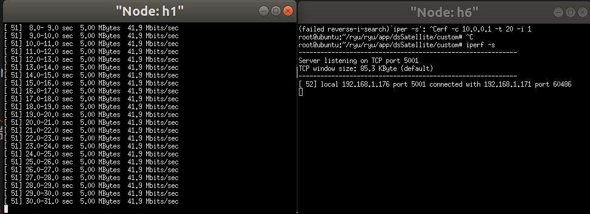
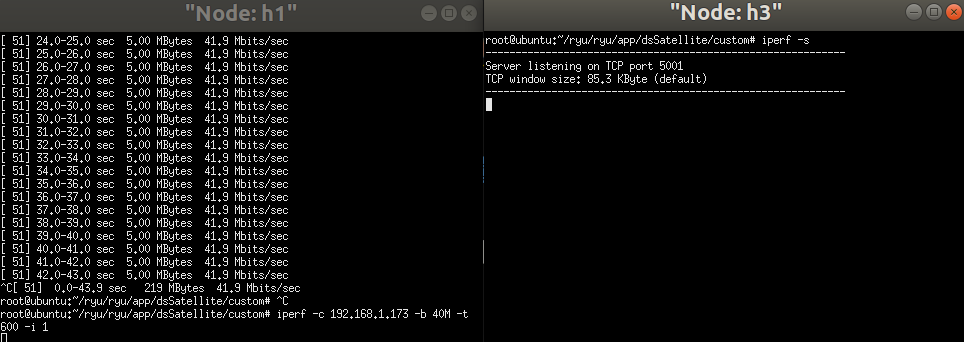

# 一、介绍
此代码为Ryu控制器代码，通过运行该代码，实现流表动态下发，在SDN交换机平台上仿真出卫星动态场景。 硬件连接如下，红色数字表示为端口号

<div align=center></div>
 <center>图0 硬件拓扑图，红色数字表示为端口号</center>

# 二、基本概念

1. mininet：mininet为网络仿真器，可在单个主机上仿真出多个SDN交换机和主机。如 `./custom/satnet_11node.py` 即为该项目中11节点的拓扑结构。
2. Ryu: SDN控制器，通过编写Python脚本，可实现流表的增删查改，进而实现自定义路由
3. 节点：每个节点由一个SDN交换机和一台主机组成，交换机负责数据转发，主机负责生成流量与任务执行。即节点=主机(host)+SDN交换机(datapath)。

# 三、快速上手

## 3.1.切换至指定目录
```bash
//切换到指定目录下
ctrl+alt+T // 打开终端
cd ryu/ryu/app/dsSatellite

tmux //分屏便于后面操作
ctrl+b
shift+5 //此时分为两个子屏幕
```

## 3.2.利用mininet启动11节点仿真环境

在子屏幕1中进行mininet仿真环境相关操作
操作如下

```bash
//通过mininet启动11个节点的虚拟环境
cd custom
sudo python ./satnet_11node.py
```

<div align=center></div>
 <center>图1 mininet运行11节点虚拟环境</center>

## 3.3.启动控制器

在子屏幕2中进行Ryu控制器相关操作
操作如下

```bash
ryu-manager simple_switch.py --ofp-tcp-listen-port 6633
```

结果如下图所示， group代表用户群组，sr代表卫星，dc代表地面数据中心
若两个节点之间有实线，则表明两个节点之间存在通路，可ping通

 <div align=center></div>
 <center>图2 启动Ryu控制器</center>


## 3.4.连通性测试(发送流量)

### 3.4.1.打开节点终端

在子屏幕1（mininet终端）中输入想打开的节点主机，比如我们想打开group1,gourp3和sr1三个节点的主机则输入

```bash
xterm h1 h3 h6
```

</bold>Note: gourp1-group5、sr1-sr5、dc1节点主机名在mininet中分别叫作h1-h11，对应的ip地址见`./Config/11node.json`文件

 <div align=center></div>
 <center>图3 三个节点的虚拟终端</center>

### 3.4.2.测试流量

为了发送流量，我们需要指定客户端和服务器端。由图二拓扑图可看出，group1(h1)与sr1(h6)之间存在通路，group1与group3(h3)之间不存在通路。

所以若我们设置sr1与group3为服务器端，group1为客户端的话，则group1与group3不能ping通，group1与sr1之间可ping通。

通过查询`./Config/11node.json`文件可知，group1、group3和sr1的ip地址分别为`192.168.1.171`,`192.168.1.173`,`192.168.1.176`.

#### 3.4.2.1 首先我们要先指定gourp3(h3)、sr1(h6)为服务器端

在h3和h6的虚拟终端中输入
```bash
iperf -s //通过iperf指定该主机为服务器主机, -s表明该节点为服务器节点
```

<div align=center></div>
 <center>图4 指定sr1(h6)为服务器端</center>

 #### 3.4.2.2 指定group1(h1)为客户端，sr1(h6)发送流量

测试group1(h1)向sr1(h6)发送流量，在h1虚拟终端中输入如下
```bash
iperf -c 192.168.1.176 -b 40M -t 30 -i 1 //192.168.1.176 为sr1的ip地址，-b 40M表明发送流量带宽为40M， -t 30 表明发送流量30s， -i 1 表明终端log信息打印间隔为1
```

<div align=center></div>
 <center>图5 h1向h6发送流量</center>

 可以看出流量发送成功，说明h1和h6间存在通路

 #### 3.4.2.3 指定group1(h1)为客户端，group3(h3)发送流量

 测试group1(h1)向group3(h3)发送流量，在h1虚拟终端中输入如下
```bash
iperf -c 192.168.1.173 -b 40M -t 30 -i 1 //192.168.1.173 为group3的ip地址，-b 40M表明发送流量带宽为40M， -t 30 表明发送流量30s， -i 1 表明终端log信息打印间隔为1
```

<div align=center></div>
 <center>图6 h1向h3发送流量</center>

 可以看出流量没有发送成功，说明h1和h3间不存在通路

 # 四、相关配置

## 4.1 配置文件说明

 ```json
 {
    "stk_path": "/home/ubuntu/ryu/ryu/app/dsSatellite/sat_11node", //此路径为存储节点之间各个时刻可见性关系的目录，格式为csv文件，由STK仿真得到。文件命名规则为 节点1名称-节点2名称.csv （如group1-sr4.csv 存储了group1和sr4节点间各个时刻可见性关系）
    "enable_show_topo": true, //是否显示拓扑图，若为true则显示拓扑图，否则不显示

    "enable_monitor": false, //是否启动流量监控功能，若启动，则会在控制器终端显示指定交换机各个端口数据传输速率
    "monitor_switch": ["sr1"], //若启动流量监控功能，该项有效。该配置项表明要监控的节点交换机
    "LOGGER_LEVEL": "INFO", //LOG级别

    "meter":false, //是否启用meter表，此项还没适配，一直设为false就好
    "bandwith" : 100,

    "update_time": 0.1, //流表更新时间，表明每过0.1s，系统会根据当前系统时间索引对应的csv文件时间，并根据csv文件对应时间的拓扑更新流表
    "minutes_interval":10000, //时间尺度，若设为1000，表明每1000分钟，该平台系统时间戳拨动1分钟。由于这里设置了1000，所以在做上述实验时拓扑并没有发生变化，如果想观察拓扑变化可以把该值设小点，比如1。

    "transfer_threshold": 50, //之前给九院演示负载迁移用的，已弃用
    /*
    一、节点配置
        1. 节点配置包括节点中主机(host)的配置(ip地址和MAC地址)、节点中SDN交换机(datapath)配置(datapath的id号(10进制以及16进制))
        2. 若用Mininet搭建11节点虚拟环境，则./custom/satnet_11node.py文件会自动解析下面各个节点，并构造具有下面ip、MAC、datapath_id的节点
        3. 若部署至硬件仿真平台中，则硬件配置需要与该配置文件中的配置相符。
            主机：如group1节点主机的ip地址为192.168.1.171，则需要更改ip_addr为192.168.1.171。然后再看主机网卡的MAC地址，记下来并填到该配置文件中的eth0中。注意：最好给主机配置静态ip。
            交换机：交换机的配置主要就是指id号，有两种表示方式，包括16进制和10进制。需要对SDN交换机进行访问,看每个SDN交换机的dpid号并填写到下面。
    */
    "sat":{
        "group1":{
            "host":{
                "ip_addr": "192.168.1.171",
                "eth0":"e4:54:e8:81:fe:43"
            },
    
            "datapath": {
                "dpid": "1c4804f8f8762c41",
                "dpid_d":2037884298752044097
            } 
        },
    
        "group2":{
            "host":{
                "ip_addr": "192.168.1.172",
                "eth0":"00:00:00:00:00:02"
            },
    
            "datapath": {
                "dpid": "1c4804f8f8765bc1",
                "dpid_d":2037884298752056257
            } 
        },
    
        "group3":{
            "host":{
                "ip_addr": "192.168.1.173",
                "eth0":"e4:54:e8:81:02:e2"
            },
    
            "datapath": {
                "dpid": "5e3e486e73000502",
                "dpid_d":6790944927334270210
            } 
        },

        "group4":{
            "host":{
                "ip_addr": "192.168.1.174",
                "eth0":"00:00:00:00:00:04"
            },
    
            "datapath": {
                "dpid": "4",
                "dpid_d":4
            } 
        },

        "group5":{
            "host":{
                "ip_addr": "192.168.1.175",
                "eth0":"00:00:00:00:00:05"
            },
    
            "datapath": {
                "dpid": "5",
                "dpid_d":5
            } 
        },
    
        "sr1":{
            "host":{
                "ip_addr": "192.168.1.176",
                "eth0":"00:00:00:00:00:06"
            },
    
            "datapath": {
                "dpid": "1c4804f8f8765cc1",
                "dpid_d":2037884298752056513
            } 
        },
    
        "sr2":{
            "host":{
                "ip_addr": "192.168.1.177",
                "eth0":"00:00:00:00:00:07"
            },
    
            "datapath": {
                "dpid": "1c4804f8f8764241",
                "dpid_d":2037884298752049729
            } 
        },
    
        "sr3":{
            "host":{
                "ip_addr": "192.168.1.178",
                "eth0":"00:00:00:00:00:08"
            },
    
            "datapath": {
                "dpid": "1c4804f8f87636c1",
                "dpid_d":2037884298752046785
            } 
        },

        "sr4":{
            "host":{
                "ip_addr": "192.168.1.179",
                "eth0":"00:00:00:00:00:09"
            },
    
            "datapath": {
                "dpid": "9",
                "dpid_d":9
            } 
        },

        "sr5":{
            "host":{
                "ip_addr": "192.168.1.180",
                "eth0":"00:00:00:00:00:10"
            },
    
            "datapath": {
                "dpid": "a",
                "dpid_d":10
            } 
        }
    },

    "dc":{
        "dc1":{
            "host":{
                "ip_addr": "192.168.1.170",
                "eth0":"00:00:00:00:00:00"
            },
    
            "datapath": {
                "dpid": "1c4804f8f87636d1",
                "dpid_d":2037884298752046801
            }
        } 
    },

    /*
    硬件层面交换机各个端口之间的连接关系，此处不要改动
    */
    "link_port_num":{
        "group1_to_sr1": 1,
        "group1_to_sr2": 2,
        "group1_to_sr3": 3,
        "group1_to_sr4": 4,
        "group1_to_sr5": 5,
        "group1_to_host": 6,

        "group2_to_sr1": 1,
        "group2_to_sr2": 2,
        "group2_to_sr3": 3,
        "group2_to_sr4": 4,
        "group2_to_sr5": 5,
        "group2_to_host": 6,

        "group3_to_sr1": 1,
        "group3_to_sr2": 2,
        "group3_to_sr3": 3,
        "group3_to_sr4": 4,
        "group3_to_sr5": 5,
        "group3_to_host": 6,

        "group4_to_sr1": 1,
        "group4_to_sr2": 2,
        "group4_to_sr3": 3,
        "group4_to_sr4": 4,
        "group4_to_sr5": 5,
        "group4_to_host": 6,

        "group5_to_sr1": 1,
        "group5_to_sr2": 2,
        "group5_to_sr3": 3,
        "group5_to_sr4": 4,
        "group5_to_sr5": 5,
        "group5_to_host": 6,

        "sr1_to_group1": 1,
        "sr1_to_group2": 2,
        "sr1_to_group3": 3,
        "sr1_to_group4": 4,
        "sr1_to_group5": 5,
        "sr1_to_sr2": 6,
        "sr1_to_sr3": 7,
        "sr1_to_sr4": 8,
        "sr1_to_sr5": 9,
        "sr1_to_dc1": 10,
        "sr1_to_host": 11,

        "sr2_to_group1": 1,
        "sr2_to_group2": 2,
        "sr2_to_group3": 3,
        "sr2_to_group4": 4,
        "sr2_to_group5": 5,
        "sr2_to_sr1": 6,
        "sr2_to_sr3": 7,
        "sr2_to_sr4": 8,
        "sr2_to_sr5": 9,
        "sr2_to_dc1": 10,
        "sr2_to_host": 11,

        "sr3_to_group1": 1,
        "sr3_to_group2": 2,
        "sr3_to_group3": 3,
        "sr3_to_group4": 4,
        "sr3_to_group5": 5,
        "sr3_to_sr1": 6,
        "sr3_to_sr2": 7,
        "sr3_to_sr4": 8,
        "sr3_to_sr5": 9,
        "sr3_to_dc1": 10,
        "sr3_to_host": 11,

        "sr4_to_group1": 1,
        "sr4_to_group2": 2,
        "sr4_to_group3": 3,
        "sr4_to_group4": 4,
        "sr4_to_group5": 5,
        "sr4_to_sr1": 6,
        "sr4_to_sr2": 7,
        "sr4_to_sr3": 8,
        "sr4_to_sr5": 9,
        "sr4_to_dc1": 10,
        "sr4_to_host": 11,

        "sr5_to_group1": 1,
        "sr5_to_group2": 2,
        "sr5_to_group3": 3,
        "sr5_to_group4": 4,
        "sr5_to_group5": 5,
        "sr5_to_sr1": 6,
        "sr5_to_sr2": 7,
        "sr5_to_sr3": 8,
        "sr5_to_sr4": 9,
        "sr5_to_dc1": 10,
        "sr5_to_host": 11,

        "dc1_to_sr1": 1,
        "dc1_to_sr2": 2,
        "dc1_to_sr3": 3,
        "dc1_to_sr4": 4,
        "dc1_to_sr5": 5,
        "dc1_to_host": 6
    }

}
 ```
